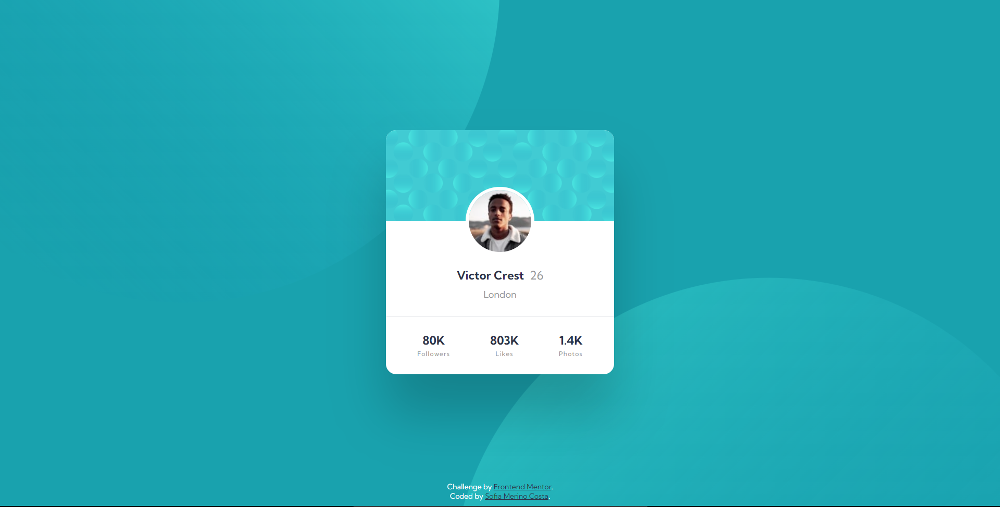
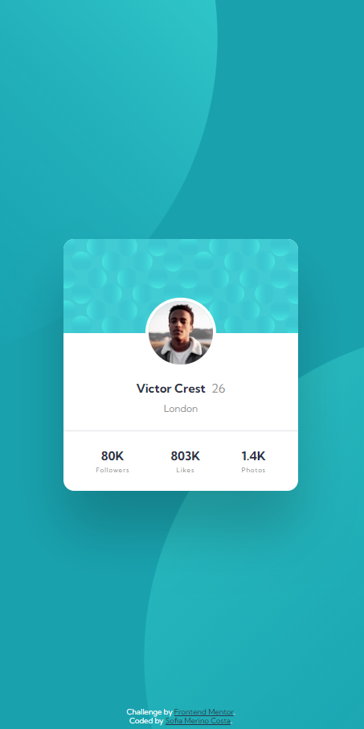

# Frontend Mentor - Profile card component solution

This is a solution to the [Profile card component challenge on Frontend Mentor](https://www.frontendmentor.io/challenges/profile-card-component-cfArpWshJ). Frontend Mentor challenges help you improve your coding skills by building realistic projects. 

## Table of contents

- [Frontend Mentor - Profile card component solution](#frontend-mentor---profile-card-component-solution)
  - [Table of contents](#table-of-contents)
  - [Overview](#overview)
    - [The challenge](#the-challenge)
    - [Screenshot](#screenshot)
    - [Links](#links)
  - [My process](#my-process)
    - [Built with](#built-with)
    - [What I learned](#what-i-learned)
  - [Author](#author)

**Note: Delete this note and update the table of contents based on what sections you keep.**

## Overview

### The challenge

- Build out the project to the designs provided

### Screenshot


<p align="center">
  
</p>


### Links

- Solution URL: [Frontend Mentor](https://your-solution-url.com)
- Live Site URL: [GitHub Pages](https://sophie-mc-dev.github.io/profile-card-component/)


## My process

### Built with

- Semantic HTML5 markup
- CSS custom properties
- Flexbox

**Note: These are just examples. Delete this note and replace the list above with your own choices**

### What I learned

1. Allowing main container's elements and content to determine the height of the container instead of giving a fixed height.

2. background-position
```css
background-image: url(./images/bg-pattern-top.svg), url(./images/bg-pattern-bottom.svg);
background-repeat: no-repeat, no-repeat;
background-position:
  right 50vw bottom 40vh,
  left 45vw top 55vh;
```

## Author

- LinkedIn - [Sofia Merino Costa](https://www.linkedin.com/in/sofia-m-costa/)
- Frontend Mentor - [@sophie-mc-dev](https://www.frontendmentor.io/profile/sophie-mc-dev)